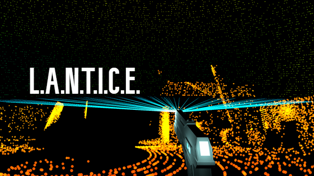
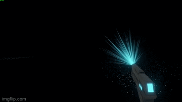
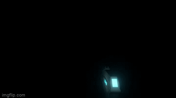
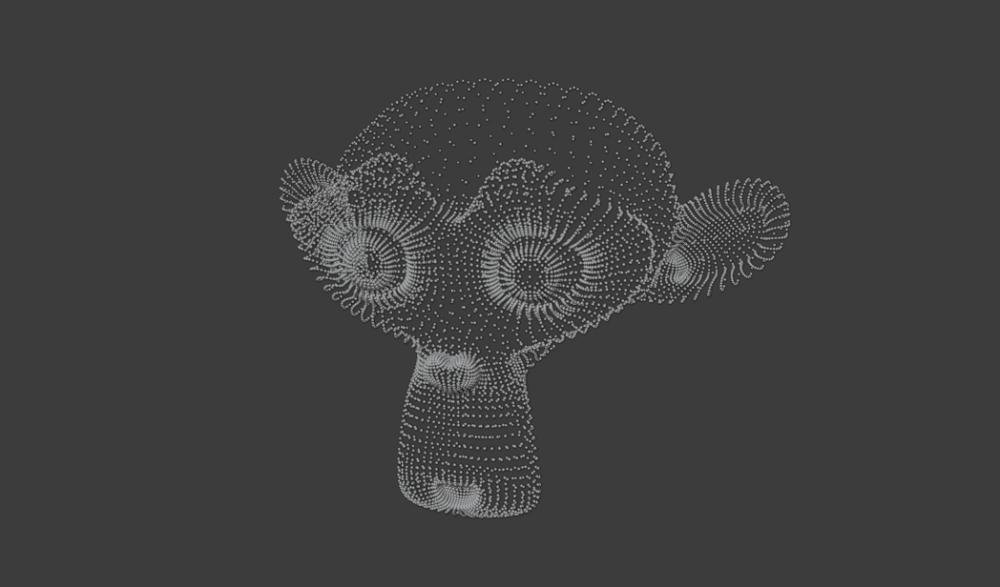
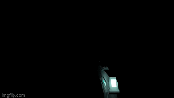

# LANTICE

LANTICE is a Unity game based on Scanner Sombre and LIDAR (Garry's Mod).

  

## Inspiration

One day, I was playing Valorant with a friend when I stumbled across [an interesting video](https://www.youtube.com/watch?v=EPJhdmye9eE&t=68s). The video features an extension of Garry's Mod called LIDAR, in which the level is invisible but the player can slowly reveal its topology using a [LIDAR](https://en.wikipedia.org/wiki/Lidar) scanner. I did what any sane techie does when they see an awesome piece of technology. I recreated it myself.

## Method

### Decals

When I decided to recreate what I had seen in the LIDAR video, my initial plan was to use decals. After a trivial amount of work, I successfully implemented this method with the following algorithm:

1. Cast a ray from the tip of the scanner to the cursor
2. Instantiate a quad at the hit point

  

_Easy, right?_ Well the brute force method, as it usually does, had some glaring issues. Mainly, the **overhead of spawning and rendering thousands of game objects** had a huge impact on performance, limiting me to a measly ~50K points. To combat this, I lowered the scan rate and only spawned decals at the end of some rays, and that's just no good. The point cap could still easily be reached in about a minute or two. It looked and played like crap and I was not a happy camper.

### Shaders ([DrawMeshInstancedIndirect](https://docs.unity3d.com/ScriptReference/Graphics.DrawMeshInstancedIndirect.html))

I posted [the video](https://www.youtube.com/watch?v=CrYKLJR1Hhg) of my LIDAR clone on /r/Unity3D, asking how I could improve performance. I was met with some great feedback, and one user sent me down a rabbit hole of rendering meshes directly using a shader. I received  a link to a blogger (their blog post is down, now) whose [source code](https://github.com/Toqozz/blog-code/tree/master/mesh_batching) was almost exactly what I needed. The shader method was easy for me, as an intermediate user, to understand:

1. Initialize a PointRenderer class with a ComputeBuffer and a material with a custom shader
2. Pass a hit point (Vector3) to the PointRenderer
3. Cache the point locally in an array (with the other points), then send the array to the ComputeBuffer
4. In the custom shader, use a vertex shader to set the vertices of the quad and a fragment shader to set the color (shown almost exactly [here](https://docs.unity3d.com/Manual/SL-VertexProgramInputs.html))
5. Call Graphics.DrawMeshInstancedIndirect with a quad mesh, the material w/ custom shader, and the ComputeBuffer

  

_Some of the specifics were lost on me, so it's a great thing I found code to borrow ;)_ With shaders, I could now render 1 million points concurrently with no noticeable performance impact between an empty scene and one with a completely populated compute buffer. Unfortunately, this approach had some problems too. Namely, increasing the size of the compute buffer to accomodate 2 million points (up from 1 million) resulted in my computer getting very hot and beeping loudly (not kidding). To me, this seemed like an obvious shortcoming; if increasing the size of the compute buffer caused my PC with a 3070 Ti to almost have a heart attack, then I can only imagine the effects it would have on a lower-end system. Could a 5-year-old computer handle even 1 million points or would I have to dynamically decrease the population based on the user's specs? I decided this would problematic.

The other problem I ran into was having trouble computing normals for the points correctly. What I mean by that is that points should always face outwards, parallel to the surface of the wall to which they cling. For some reason, I couldn't figure out how to calculate this. In hindsight, I could have just passed the position of the player to the custom shader and had the point always face him. Also, the restrictions of the compute buffer could have been addressed by creating several instances of the point renderer, each with their own shader and smaller compute buffer. But, my woes were addressed when I discovered a piece of technology built into Unity that I thought would be even better...

### Point Clouds (an interlude)

Before reaching the ultimate solution, I came across a lot of material on point clouds. A point cloud is a set of points in space that represent a 3D object, as seen in the picture below ([Blender Manual](https://docs.blender.org/manual/en/latest/modeling/point_cloud.html)). Point clouds are a typical way to represent data captured by LIDAR scanning since they're just a set of points. 

  

At about this time, I started to investigate the game Scanner Sombre since it also simulates LIDAR scanning. After trying out the demo on Steam, I decided that I was a big fan of the aesthetic of LIDAR (Garry's Mod) but I was more fond of Scanner Sombre's functionality, which did not have a perceivable limit to the number of points rendered on-screen. Using a [tutorial on GitHub](https://github.com/imadr/Unity-game-hacking) that I found in about 2 minutes, I was able to crack open Scanner Sombre's source code and try to figure out what they did. Sure enough, I spotted a class called "SerializablePointCloud" which I believe is used to save and reload points after exiting the game. I also found several references in classes to Unity's built-in [ParticleSystem](https://docs.unity3d.com/ScriptReference/ParticleSystem.html), which made no sense to me because Shuriken particles run on the CPU so the engine can only handle about 200K before performance becomes noticeably bad ([Brackeys](https://docs.google.com/spreadsheets/d/1dZ5NRIxKxy287jUVc6WnQ-2DIWazmrpHGXEO1vfuHis/edit#gid=0)). The last thing I'd like to mention about the source code is the "BSPTree" class, although its ultimate purpose seems to be calling "DebugDraw.DrawTriangle" which wouldn't be visible in-game.

It was interesting to dig around in a semi-popular indie game's guts even if I didn't completely understand what I was looking at. While I'm fairly confident that the game uses Shuriken particles, I still don't know how it's able to render so many at once. Anyways, point clouds and LIDAR scanning seem to be a popular combo, so if you're interested in learning more about them, consider the following resources:

- "Visualization of Large Point Cloud in Unity," 2019 https://diglib.eg.org/bitstream/handle/10.2312/egp20191050/023-024.pdf.
- "From Point Cloud to Grid DEM: A Scalable Approach," 2006 http://terrain.cs.duke.edu/pubs/lidar_interpolation.pdf.
- "Pcx - Point Cloud Importer/Renderer for Unity," 2017 https://github.com/keijiro/Pcx.
  - This resource is especially interesting since it describes several approaches for storing and rendering point clouds (and thus ways to recreate LIDAR)
    - Storing: Mesh, ComputeBuffer (my second approach), Texture2D (my final approach)
    - Rendering: point primitives (vertex shader), disks (geometry shader)

### VFX Graph

During my little detour through the world of point clouds, I discovered that Scanner Sombre uses Unity's Shuriken particle system to render its points. While the game proved that this method was appropriate for the use case, I wanted to see just how far you could take it. I stumbled across a [video by Brackeys](https://www.youtube.com/watch?v=0deXRHX9C08) in which he tries to find the maximum concurrent number of particles the engine can handle before it breaks. The results for the built-in particle system were less than stellar compared to what Unity's VFX graph can do: an average of 77 FPS with 20 million particles on screen. I had found my ace in the hole.

Having had to learn VFX graph for this project, I think I've figured out that it's much like Unity's built-in particle system but uses node-based visual logic instead of requiring users to manipulate parameters in a component. Similar to shaders, you can also pass variables directly into VFX graph, such as vectors, ints and floats, or even a texture. The following algorithm is how I managed to render individual points at specific locations through VFX graph:

1. Create a VisualEffect object with a capacity of the max width of a Texture2D (16384)
2. Create a Texture2D with its max width and a height of 1 using the RGBAFloat format
3. Create an array of Colors which we'll encode as Vector3s using R = X, G = Y, B = Z, A = Visible/Invisible
4. Cache points by keeping an index of the particle count and assigning the Color at that index to the position of the new point
5. Every frame, set the pixels of the Texture2D using the array of Colors, apply the changes, pass the texture to the VFX graph, then reinitialize it to redraw the points
6. If the particle count exceeds the width of the Texture2D, then instantiate a new VisualEffect object and leave the old one alone
7. (Optional) Apply a color gradient by using the distance to the point from the player (which you can pass into the VFX graph as a Vector3) as the parameter along the gradient

_Step 7 should be performed in the "UpdateParticle" step of the VFX graph lifecycle, otherwise, the points' colors will be static._

  

I would be lying if I said I figured this one out alone. I started by simply trying to render points at specific locations using data encoded in a Texture2D, but without knowing VFX graph it was like trying to pilot a plane with no formal training. I was frustrated, so I took to YouTube to see if anyone had done something similar. Sure enough, some guy had taken this same approach, specifically in the context of LIDAR (Garry's Mod), and generously posted his source code on [GitHub](https://github.com/leonhardrobin/LiDAR-GarrysMod_Unity). I still wanted a unique solution that I could call my own, so I simplified his code with a Texture2D of height 1 (thus simulating a 1D array), and applied a color gradient to the points; points further away are cooler and points closer are warmer, changing based on the player's distance to them.

And that's sorta where I left off. I have an implementation that I'm happy with and a little tech demo that's interesting enough to stand on its own, but also has room to build on.

## Looking Ahead

I think if I were to build on this project in the future, the obvious thing to do would be to make a game. LIDAR (Garry's Mod) and Scanner Sombre are both pseudo-horror/walking simulators, but I don't want to add to that pile. Instead, I think it would be an interesting exercise in design and creativity to make this a multiplayer game. The innate horror aspect of it might translate well into survival-horror elements, but I also have a hunch that it would make a neat first-person shooter.

Even if I don't turn this into a game, I'm still satisfied with what I've done. I learned a lot by simply trying to recreate an eye-catching piece of technology and I wouldn't have it any other way.

## Acknowledgements

LANTICE was inspired by the following projects:

- datæ. _LIDAR (Garry's Mod)_, 2022 (https://steamcommunity.com/sharedfiles/filedetails/?id=2813176307).
- Introversion Software. _Scanner Sombre_, 2017 (https://introversion.co.uk/scannersombre/#).
- Leonhard "leonhardrobin" Schnaitl. "LiDAR-GarrysMod_Unity," 2022 (https://github.com/leonhardrobin/LiDAR-GarrysMod_Unity).
- Michael "Toqozz" Palmos. "Mesh Batching," 2021 (https://github.com/Toqozz/blog-code/tree/master/mesh_batching).
